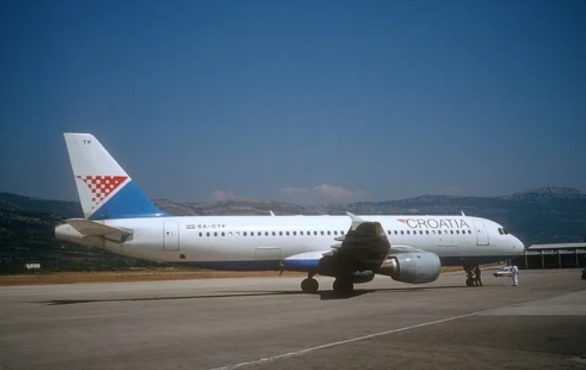
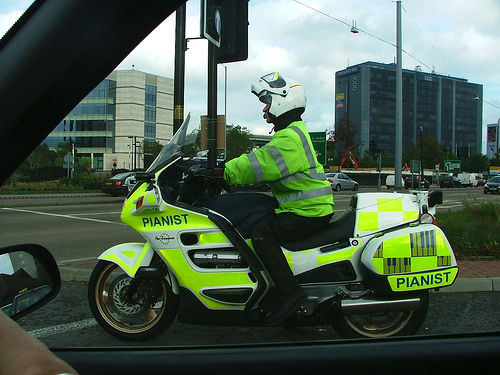

# Vision-Language Model with SigLIP + LLaMA3.2

A lightweight Vision-Language Model (VLM) built from scratch using a pretrained Vision Transformer and a LoRA-tuned LLaMA 3.2 language model.

The trained model will be uploaded in Releases due to size limitations from GitHub. Move it into `checkpoints\` for proper use.

Please download LLaMA model and json files into `Llama-3.2-3B\` for training or inference.

***PLEASE MODIFY ALL PATHS IN EVERY PYTHON FILE FOR PROPER DEPLOYMENT***

This project implements the core ideas behind modern multimodal systems such as LLaVA and MiniGPT-4:

```
Image → Vision Encoder → Projector → LLM → Text
```

The model is capable of generating natural language descriptions from images after multimodal alignment training.

# Features

- SigLIP Vision Transformer encoder

- Multi-token visual feature alignment

- Learnable positional embeddings for visual tokens

- MLP projector for vision-language alignment

- LLaMA 3.2 Instruct as language backbone

- LoRA fine-tuning for efficient training

- Image caption generation

- Flickr30k training + COCO transfer learning

- Custom multimodal training pipeline implemented in PyTorch

# Model Architecture

```
                ┌─────────────────┐
Image ────────► │  SigLIP ViT     │
                └────────┬────────┘
                         │
                  Visual Tokens
                         │
                ┌────────▼────────┐
                │  MLP Projector  │
                └────────┬────────┘
                         │
          Visual Embeddings + Position Embeddings
                         │
         <IMG_START> ... <IMG_END>
                         │
                ┌────────▼────────┐
                │  LLaMA 3.2 LLM │
                └─────────────────┘
                         │
                    Generated Text
```

# Training Strategy

***Stage 1 — Flickr30k Alignment Training***

Dataset:

  - Flickr30k

Purpose:

  - Initial multimodal alignment between visual and language embeddings.

Hardware:

  - AMD Radeon RX 7900 XTX (24GB VRAM)

Training:

  - Train MLP projector

  - LoRA fine-tuning on LLaMA 3.2

  - Multi-token visual embedding alignment

  - Learnable visual positional embeddings

  - Modality separator tokens

***Stage 2 — COCO Transfer Learning***


Dataset:

  - MS COCO

Purpose:

  - Improve caption quality and generalization ability.

Hardware:

  - NVIDIA RTX 3080 20GB (modified edition)

Training:

  - Continued multimodal alignment with LoRA fine-tuning

  - Instruction-style prompting

# Technologies Used

***Core Frameworks***

  - PyTorch

  - Transformers

  - PEFT

***Models***

  - SigLIP
  
  - LLaMA 3.2 Instruct

# Key Implementations

***Multi-Token Vision Injection***

Instead of using only the CLS token, patch-level visual tokens are injected into the LLM:

```python
vision_feat = vision_outputs.last_hidden_state[:, 1:65]
```

***Learnable Visual Position Embedding***

```python
visual_emb = visual_emb + self.visual_pos_embed[:, :N, :]
```

This preserves spatial information after projection into language embedding space.

***Modality Separator Tokens***

```
<IMG_START> [VISUAL TOKENS] <IMG_END>
```

Improves multimodal alignment stability and generation quality.

# LoRA Fine-Tuning

Efficient adaptation of the language model using Low-Rank Adaptation (LoRA), reducing memory usage significantly compared to all-layer-tuning while maintaining strong language generation capability.

# Example Outputs

***Example 1***

Input:



Output:

```
A large jetliner is parked on the runway.
```

Example 2

Input:



Output:

```
 A police officer on a motorcycle on a city street.
```

# Results

The model successfully learned cross-modal alignment between images and language and was able to generate coherent image captions from unseen images.

Despite using a lightweight architecture and consumer hardware, the system achieved functional multimodal understanding and stable text generation.

# Hardware
| Stage |	GPU |
|---|---|
| Flickr30k Training	| AMD Radeon RX 7900 XTX 24GB |
| COCO Transfer Learning | NVIDIA RTX 3080 20GB Mod |

# Project Structure

├── train.py

├── inference.py

├── Llama-3.2-3B

├── merge.py

├── checkpoints/

├── testpics/

└── README.md

# Acknowledgements

***Inspired by:***

  - LLaVA

  - MiniGPT-4

# License

Follows to licenses from Siglip and LLaMA (if any).
